# StormVision

[](https://www.python.org/downloads/)
[](https://pytorch.org/)
[](https://github.com/ultralytics/ultralytics)
[](https://colab.research.google.com/)

**Maritime Object Detection from Aerial Drone Imagery in Stormy Conditions using Synthetic Data Augmentation**

> An end-to-end deep learning pipeline that enhances maritime object detection under adverse weather conditions by generating realistic synthetic stormy sea training data using state-of-the-art diffusion models.

---

## Table of Contents

- [Overview](#overview)
- [Pipeline Architecture](#pipeline-architecture)
- [Synthetic Data Examples](#synthetic-data-examples)
- [Key Results](#key-results)
- [Data](#data)
- [Installation](#installation)
- [Repository Structure](#repository-structure)
- [Training](#training)
- [Quick Start](#quick-start)
- [Limitations](#limitations)
- [Acknowledgments](#acknowledgments)

---

## Overview

### Problem Statement

Maritime search-and-rescue operations rely heavily on drone-based detection of swimmers, boats, and other small objects. However, detection models trained on calm-sea imagery **fail catastrophically** in stormy conditions due to:

- **Domain shift**: Choppy water, foam, and spray create visual noise
- **Low visibility**: Rain, mist, and dark clouds reduce contrast
- **Object occlusion**: Waves can partially or fully obscure swimmers

### The Data Gap

> **There is currently NO publicly available labeled dataset of aerial drone footage capturing maritime objects in stormy sea conditions.**

Collecting real stormy-sea training data is:
- **Dangerous**: Flying drones in storms risks equipment loss and human safety
- **Expensive**: Requires specialized equipment and trained operators
- **Rare**: Stormy conditions suitable for data collection are unpredictable
- **Ethically challenging**: Cannot place swimmers in dangerous waters for data collection

This gap motivates our synthetic data generation approach.

### Solution

**StormVision** addresses this by:

1. **Generating synthetic stormy sea backgrounds** using SDXL inpainting with ControlNet depth guidance
2. **Preserving original objects** with SAM-based precise segmentation
3. **Training robust YOLOv8 detectors** on the augmented dataset

---


## Pipeline Architecture

The project consists of two main pipelines:

### Pipeline 1: Synthetic Stormy Sea Image Generation

This pipeline transforms calm-sea maritime images into realistic stormy conditions while preserving all objects.

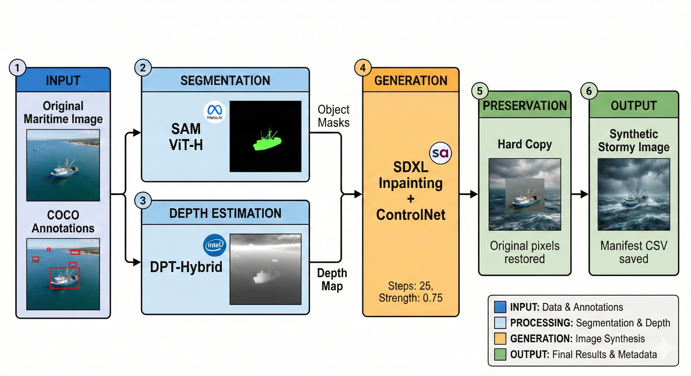

| Step | Component | Description |
|------|-----------|-------------|
| 1 | SAM ViT-H | Precise pixel-level object segmentation |
| 2 | DPT-Hybrid | Depth estimation for wave geometry guidance |
| 3 | SDXL + ControlNet | Stormy background generation |
| 4 | Hard Copy | Original objects preserved perfectly |

### Pipeline 2: Model Training & Evaluation

This pipeline compares multiple YOLO models to evaluate the impact of synthetic data augmentation.

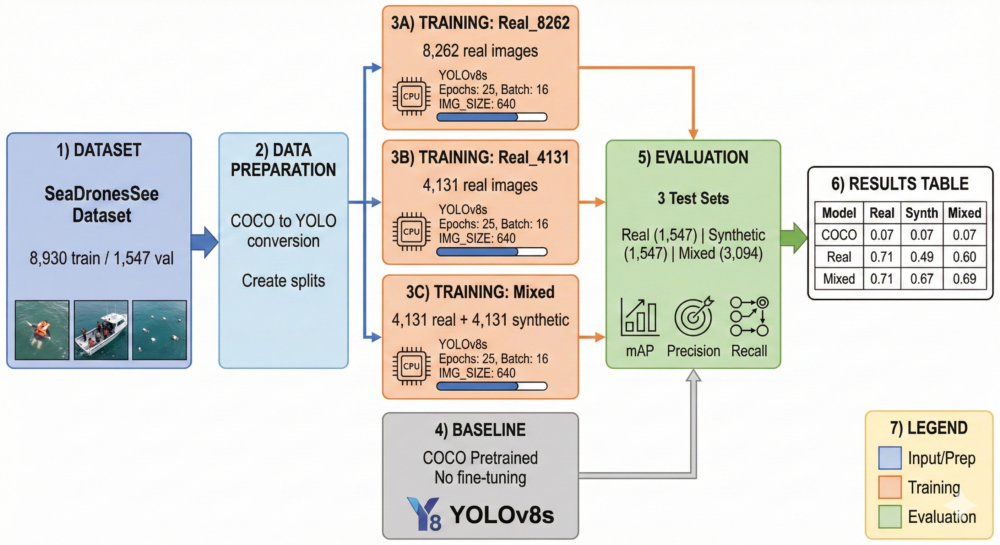

| Model | Training Data | Purpose |
|-------|---------------|---------|
| COCO Pretrained | MS-COCO (80 classes) | Baseline |
| Real_8262 | 8,262 real images | Full real data |
| Real_4131 | 4,131 real images | Fair comparison |
| Mixed | 4,131 real + 4,131 synthetic | Augmentation test |

### Component Summary

| Component | Technology |
|-----------|------------|
| Object Segmentation | SAM ViT-H (Meta) |
| Depth Estimation | DPT-Hybrid (Intel) |
| Background Generation | SDXL + ControlNet |
| Object Detection | YOLOv8s (Ultralytics) |

---

## Synthetic Data Examples

The synthetic generation pipeline transforms calm-sea images into realistic stormy conditions while preserving all objects.

<table>
<tr><th>Original (Calm Sea)</th><th>Synthetic (Stormy Sea)</th></tr>
<tr>
<td>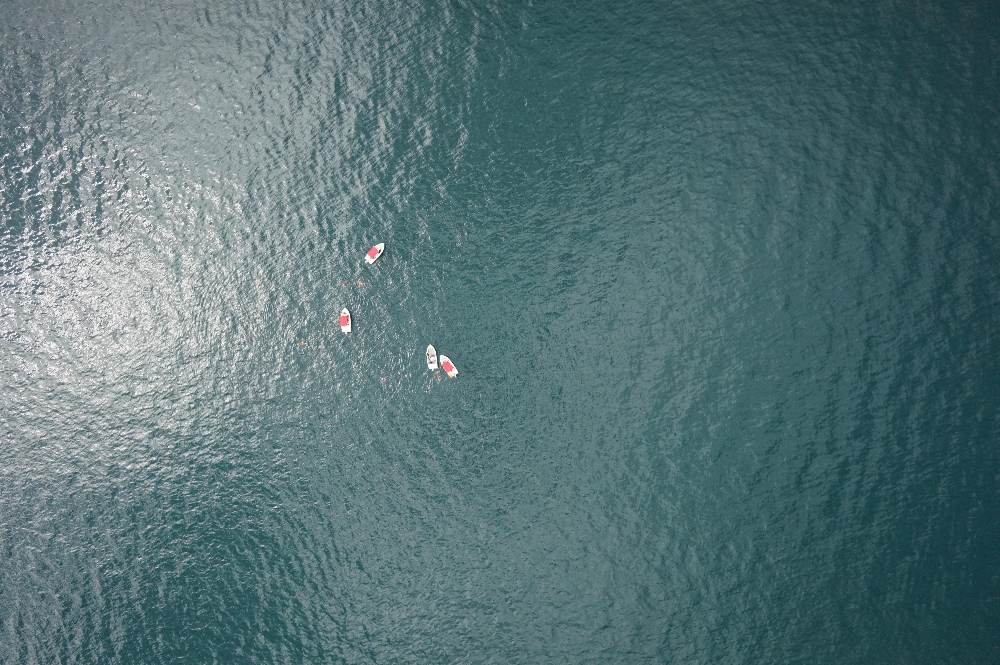</td>
<td>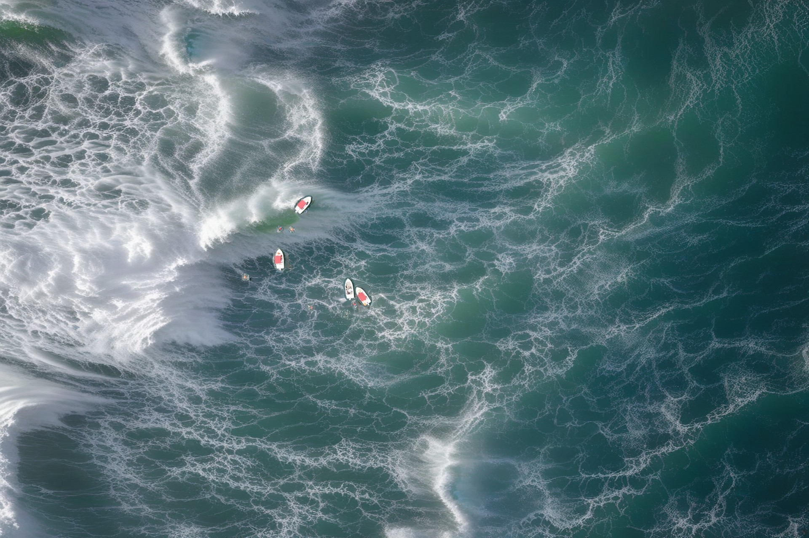</td>
</tr>
<tr>
<td>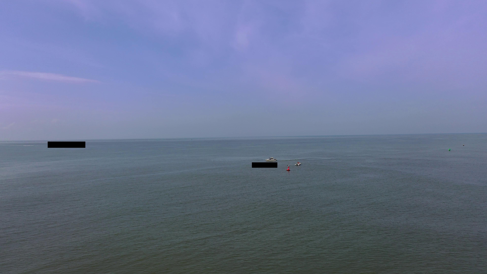</td>
<td>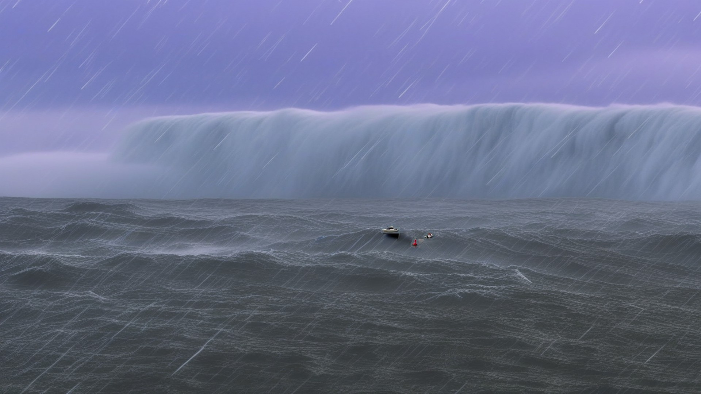</td>
</tr>
<tr>
<td>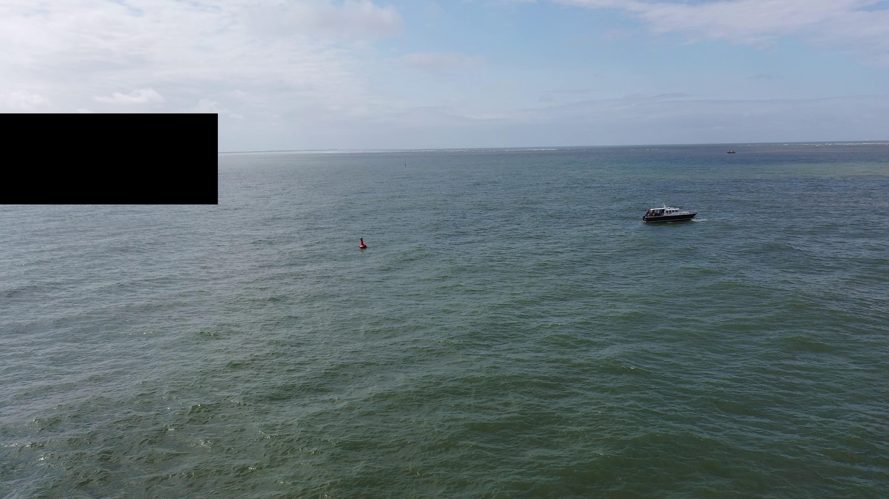</td>
<td>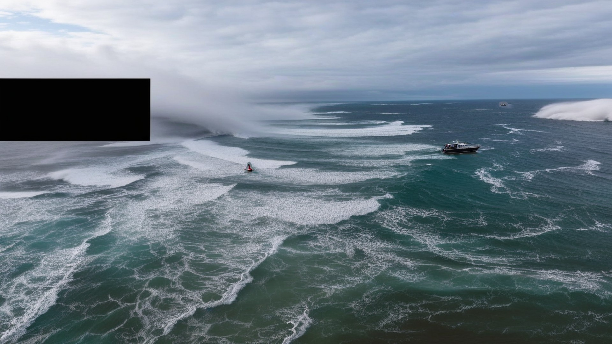</td>
</tr>
</table>

---

## Key Results

### Model Performance (mAP@0.5)

| Model | Training Data | Real Test | Synthetic Test | Mixed Test |
|-------|---------------|-----------|----------------|------------|
| COCO Pretrained | MS-COCO | 0.073 | 0.066 | 0.069 |
| Real_8262 | 8,262 real | 0.708 | 0.491 | 0.604 |
| Real_4131 | 4,131 real | 0.687 | 0.493 | 0.593 |
| **Mixed** | 4,131 real + 4,131 synth | **0.709** | **0.671** | **0.689** |

### Key Findings

- **x10 improvement** over COCO baseline
- **+18% improvement** on synthetic test (Mixed vs Real_4131)
- **Robustness**: Mixed model drops only 5% on stormy images vs 28% for Real-only

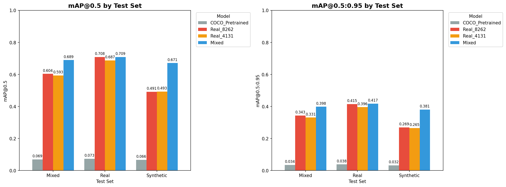

### Robustness Analysis

The critical question: **How well do models generalize from calm to stormy conditions?**

| Model | Real Test | Synthetic Test | Drop |
|-------|-----------|----------------|------|
| Real_8262 | 0.708 | 0.491 | **-31%** |
| Real_4131 | 0.687 | 0.493 | **-28%** |
| **Mixed** | 0.709 | 0.671 | **-5%** |

The Mixed model trained with synthetic data shows **6x better robustness** compared to real-only models.

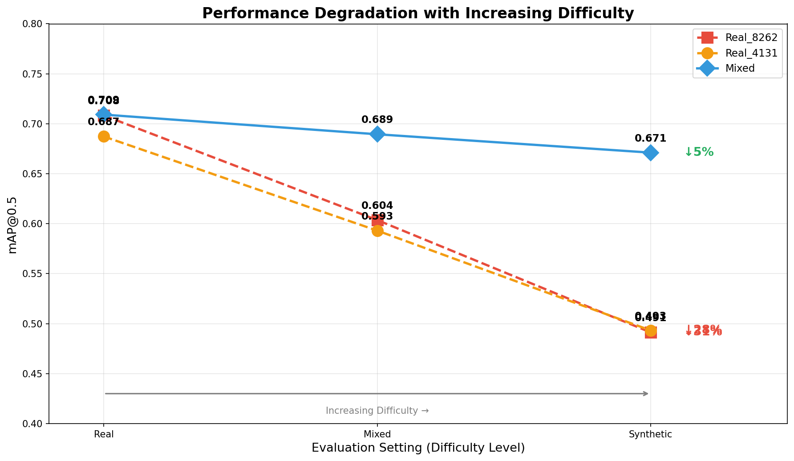

### Per-Class Performance (Mixed Model on Synthetic Test)

| Class | AP@0.5 | Notes |
|-------|--------|-------|
| swimmer | 0.697 | Primary target for SAR |
| boat | 0.945 | Highest performance |
| jetski | 0.879 | Strong detection |
| life_saving_appliances | 0.187 | Rare class, limited samples |
| buoy | 0.648 | Good performance |

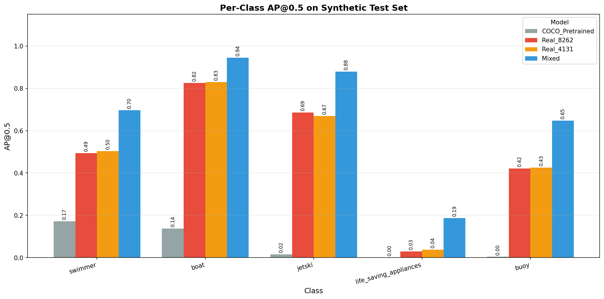

### Detection Examples

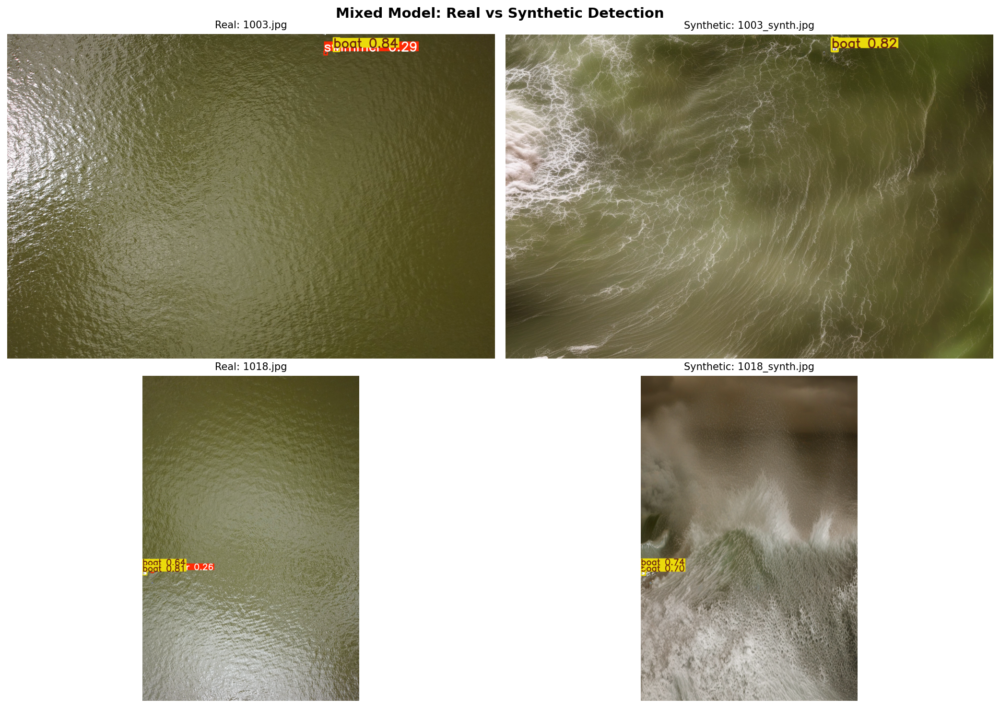

---

## Data

### Original Dataset

This project uses the **SeaDronesSee** dataset for maritime object detection.

**Dataset Link**: [SeaDronesSee](https://cloud.cs.uni-tuebingen.de/index.php/s/ZZxX65FGnQ8zjBP)

**Citation**:
```bibtex
@inproceedings{varga2022seadronessee,
  title={SeaDronesSee: A Maritime Benchmark for Detecting Humans in Open Water},
  author={Varga, Leon Amadeus and Kiefer, Benjamin and Messmer, Martin and Zell, Andreas},
  booktitle={Proceedings of the IEEE/CVF Winter Conference on Applications of Computer Vision},
  pages={2260--2270},
  year={2022}
}
```

### Dataset Statistics

| Split | Images | Description |
|-------|--------|-------------|
| Train Real | 8,930 | Original training images (calm sea) |
| Train Synthetic | 4,131 | Generated stormy images |
| Test Real | 1,547 | Normal conditions |
| Test Synthetic | 1,547 | Stormy conditions |

### Object Classes

| ID | Class |
|----|-------|
| 0 | swimmer |
| 1 | boat |
| 2 | jetski |
| 3 | life_saving_appliances |
| 4 | buoy |

---

###  Generated Dataset Access

Due to size constraints, the full synthetic stormy dataset and processed training sets are hosted externally.

**[Download Full Dataset (Google Drive)](https://drive.google.com/drive/folders/1PY_3dqQqktGkqgg6YDjX8YhKk9sNxQp4?usp=drive_link)**

The drive folder includes:
*   `train/images`: Mix of real and synthetic training images.
*   `synthetic/`: The generated stormy images.
*   `processed/`: Cleaned labels and split files ready for YOLO training.
*   `DATASET_STRUCTURE_AND_INFO.md`: Detailed guide to the file structure.

---

##  Project Documentation

All project milestones and presentations are available in the `docs/` directory:

*   **Proposal**: [Slides (PDF)](docs/Proposal.pdf)
*   **Interim Report**: [Slides (PDF)](docs/Interim.pdf)
*   **Final Presentation**: [Slides (PDF)](docs/Final_Presentation.pdf)

---

## Installation

### Google Colab (Recommended)

```python
!pip install -q ultralytics diffusers transformers
!pip install -q git+https://github.com/facebookresearch/segment-anything.git

from google.colab import drive
drive.mount('/content/drive')
```

### Local Setup

```bash
# Clone repository
git clone https://github.com/yourusername/StormVision.git
cd StormVision

# Create environment
conda create -n stormvision python=3.10 -y
conda activate stormvision

# Install dependencies
pip install torch torchvision --index-url https://download.pytorch.org/whl/cu118
pip install ultralytics diffusers transformers accelerate
pip install numpy pandas matplotlib seaborn tqdm
```

### Requirements

- Python 3.10+
- CUDA 11.8+ (GPU required)
- 16GB+ GPU VRAM recommended

---

## Repository Structure

```
StormVision/
├── assets/                           # Diagrams & visual examples
├── docs/                             # Presentation slides & reports
├── notebooks/                        # Jupyter notebooks for the pipeline
│   ├── 00_setup.ipynb
│   ├── 01_eda.ipynb
│   ├── 02_synthetic_generation.ipynb
│   ├── 03_prepare_yolo_data.ipynb
│   └── 04_train_and_evaluate.ipynb
├── data/                             # Dataset structure (see DATASET_STRUCTURE_AND_INFO.md)
│   ├── annotations/                  # JSON annotations
│   ├── synthetic/                    # Generated stormy images
│   │   ├── test/
│   │   └── train/
│   ├── train/                        # Real training images
│   ├── val/                          # Real validation images
│   └── data.yaml                     # YOLO dataset configuration
├── results/                          # Experiment outputs
│   ├── metrics/                      # Plots & CSV results
│   └── weights/                      # Trained models
└── README.md
```

---

## Training

### Models

| Model | Training Data | Epochs |
|-------|---------------|--------|
| COCO Pretrained | MS-COCO | - |
| Real_8262 | 8,262 real | 25 |
| Real_4131 | 4,131 real | 25 |
| Mixed | 4,131 real + 4,131 synth | 25 |

### Configuration

```python
MODEL = 'yolov8s.pt'
IMG_SIZE = 640
BATCH_SIZE = 16
EPOCHS = 25
```

---

## Quick Start

### Run in Google Colab (Recommended)

```python
# 1. Install dependencies
!pip install -q ultralytics diffusers transformers
!pip install -q git+https://github.com/facebookresearch/segment-anything.git

# 2. Mount Drive
from google.colab import drive
drive.mount('/content/drive')

# 3. Run notebooks in order:
#    00_setup.ipynb          → Environment validation
#    01_eda.ipynb             → Data exploration
#    02_synthetic_generation  → Generate stormy images (~4-8 hours)
#    03_prepare_yolo_data     → Prepare YOLO format (~5 min)
#    04_train_and_evaluate    → Train models (~2-4 hours)
```
---

## Limitations

- Generated storms may lack extreme wave physics accuracy
- Very small objects (<20px) may have minor artifacts
- Optimized for aerial/drone perspectives only
- Life saving appliances class has limited training samples
- No real stormy sea data available for true validation

---


## Acknowledgments

- **SeaDronesSee Dataset**: Varga et al., University of Tübingen
- **Segment Anything Model (SAM)**: Meta AI
- **Stable Diffusion XL**: Stability AI
- **YOLOv8**: Ultralytics

---

<div align="center">

**Built for safer maritime operations**

</div>

